# System Design — Hermione Landing Page

Documentação técnica da arquitetura visual, tokens de design, sistema de cores e hierarquia de componentes da **Landing Page da Hermione**.

---

## 🎨 1. Sistema de Design & Paleta de Cores

A interface da landing page utiliza um design moderno **Dark Mode Elegante com Estética Glassmorphism e Editorial Luxury**, combinando tipografia clássica de imprensa/livros com componentes altamente tecnológicos.

### 🎨 Cores Principais (Color Tokens)

| Token / Variável | Código Hex / HSL | Aplicação no Sistema |
| :--- | :--- | :--- |
| **Fundo Principal (Canvas)** | `#030303` | Fundo global da página (`<main>`) |
| **Fundo de Cards (Dark Card)** | `#0A0A0A` | Cards semi-arredondados (`MobileAppSection`, `CTA Final`) |
| **Fundo do Footer** | `#020203` | Seção inferior técnica e rodapé |
| **Bordas & Divisores** | `rgba(255, 255, 255, 0.08)` / `border-white/10` | Delimitação de cards, colunas e separadores glass |
| **Efeito Glassmorphism** | `rgba(255, 255, 255, 0.03)` + `backdrop-blur-md` | Botões flutuantes, badges e caixas de newsletter |
| **Texto Primário** | `#FFFFFF` (`text-white`) | Títulos principais, botões CTA |
| **Texto Secundário** | `rgba(255, 255, 255, 0.60)` / `#8A94A0` | Subtítulos e parágrafos de apoio |
| **Texto Terciário / Muted** | `rgba(255, 255, 255, 0.40)` | Metadados, labels e notas de rodapé |

### ⚡ Cores de Destaque & Status

| Token / Cor | Representação HSL / Tailwind | Aplicação |
| :--- | :--- | :--- |
| **Emerald Green (Status Ativo)** | `#10B981` (`emerald-400`/`emerald-500`) | Indicadores de WebSocket conectado, usuários ativos, status online |
| **Amber Gold (Standby)** | `#F59E0B` (`amber-400`/`amber-500`) | Status de standby ou tentativa de reconexão |
| **Violet Glow (Aura Ambiental)** | `#B899FF` (`purple-500`) | Holofotes e sombras brilhantes ao fundo do aplicativo móvel (`smart.png`) |

---

## 🔤 2. Tipografia

O sistema utiliza três famílias tipográficas otimizadas do Google Fonts via `next/font/google`:

1. **`Cormorant Garamond` (Serif)**
   - **Uso**: Títulos principais de impacto (`h1`, `h2`), slogan de marca e marca d'água da Hermione.
   - **Estilo**: Elegante, refinado e com estética literária clássica.

2. **`Geist Sans` (Sans-Serif)**
   - **Uso**: Corpo de texto, parágrafos, botões de navegação, FAQ e cards de produto.
   - **Estilo**: Limpo, moderno e com legibilidade perfeita em qualquer resolução.

3. **`Geist Mono` (Monospace)**
   - **Uso**: Badges de status do WebSocket, feed de dados ao vivo, métricas numéricas e termos técnicos.
   - **Estilo**: Estética hacker/futurista para destacar tecnologias como *Yjs CRDT*, *E2E Encryption* e *Live Telemetry*.

---

## 📐 3. Estrutura de Componentes da Home Page

A página principal (`app/[lang]/(main)/page.tsx`) é construída por um encadeamento modular de componentes Next.js / React, totalmente estilizados com Tailwind CSS e animados via **Framer Motion**:

```mermaid
graph TD
    Page["Page (app/[lang]/(main)/page.tsx)"]
    Page --> Navbar["1. Navbar"]
    Page --> Hero["2. HeroSection (com InteractiveTablet)"]
    Page --> MobileApp["3. MobileAppSection (com smart.png)"]
    Page --> Metrics["4. MetricsSection (com Globo Cobe & Telemetria)"]
    Page --> Phases["5. PhasePresentationSection"]
    Page --> Testimonials["6. TestimonialSection"]
    Page --> Features["7. FeaturesSection"]
    Page --> Ecosystem["8. EcosystemSection"]
    Page --> Pricing["9. PricingSection (Integração Stripe)"]
    Page --> FAQ["10. FaqSection"]
    Page --> CTAFinal["11. CtaFinalSection"]
    Page --> Footer["12. FooterSection (Live WS Telemetry)"]
```

---

## 🛠️ 4. Detalhamento Técnico das Seções

### 1. `Navbar.tsx`
- **Função**: Barra superior de navegação com marca `"H"`, seletores de idioma (`PT`, `EN`, `ES`), links de navegação suave e botão *"Começar Grátis"*.

### 2. `HeroSection.tsx` & `InteractiveTablet.tsx`
- **Função**: Apresentação inicial do produto com o slogan principal.
- **Destaque**: Mockup interativo em 3D/CSS de um tablet carregando o editor Hermione com simulação de IA ao vivo.

### 3. `MobileAppSection.tsx`
- **Função**: Apresentação do aplicativo móvel *Chat Secret*.
- **Estrutura**:
  - Card escuro semi-arredondado (`bg-[#0A0A0A]`, borda sutil `#1A1A1A`).
  - Animação de entrada `TypewriterChar` (com `whitespace-nowrap` por palavra para evitar quebra de palavras).
  - Imagem do smartphone segurado por uma mão (`smart.png`) redimensionada proporcionalmente (`max-h-[75%]` do card) com efeito parallax suave ao rolar.

### 4. `MetricsSection.tsx`
- **Função**: Visualização de métricas globais e usuários ao vivo.
- **Destaque**: Globo interativo canvas (`cobe-globe-stickers.tsx`) acoplado ao servidor WebSocket.

### 5. `PhasePresentationSection.tsx`
- **Função**: Apresentação visual das fases da escrita (Planejamento, Rascunho, Revisão e Exportação).

### 6. `TestimonialSection.tsx`
- **Função**: Avaliações dinâmicas enviadas pelos leitores e autores na plataforma Hermione.

### 7. `FeaturesSection.tsx`
- **Função**: Grid de funcionalidades principais (Criptografia de Ponta a Ponta, Sincronização CRDT offline, Exportador PDF/DOCX).

### 8. `EcosystemSection.tsx`
- **Função**: Apresentação do ecossistema multiplataforma (Web, Desktop e Mobile Expo SDK 54).

### 9. `PricingSection.tsx`
- **Função**: Tabela de preços transparente integrada ao Stripe.

### 10. `FaqSection.tsx`
- **Função**: Accordion com as perguntas mais frequentes dos escritores.

### 11. `CtaFinalSection.tsx`
- **Função**: Bloco final de alta conversão para registro de novos usuários.

### 12. `FooterSection.tsx`
- **Função**: Rodapé institucional e hub de telemetria.
- **Integração Real**:
  - Conexão nativa via `fetch("/api/metrics")` (Prisma) e `WebSocket` (`ws://localhost:8080/ws/metrics`).
  - Feed animado ao vivo no plano de fundo exibindo edições de capítulos reais dos usuários.
  - Ícones vetoriais de redes sociais (GitHub, Twitter, Discord, LinkedIn) em SVG nativo.

---

## 🚀 5. Animações e Efeitos Visuais

1. **Parallax com Scroll**: Utiliza `useScroll` e `useTransform` para controlar escala dos cards, opacidade e flutuação de imagens de acordo com a posição da página.
2. **Typewriter Effect Inteligente**: Revelação progressiva de texto sem quebra desordenada de palavras.
3. **Spotlight Interativo de Mouse**: Gradiente radial dinâmico que segue o cursor do usuário na seção do rodapé.
4. **WebSocket Pulse Status**: Animação CSS `animate-ping` que indica a integridade da conexão WebSocket.
